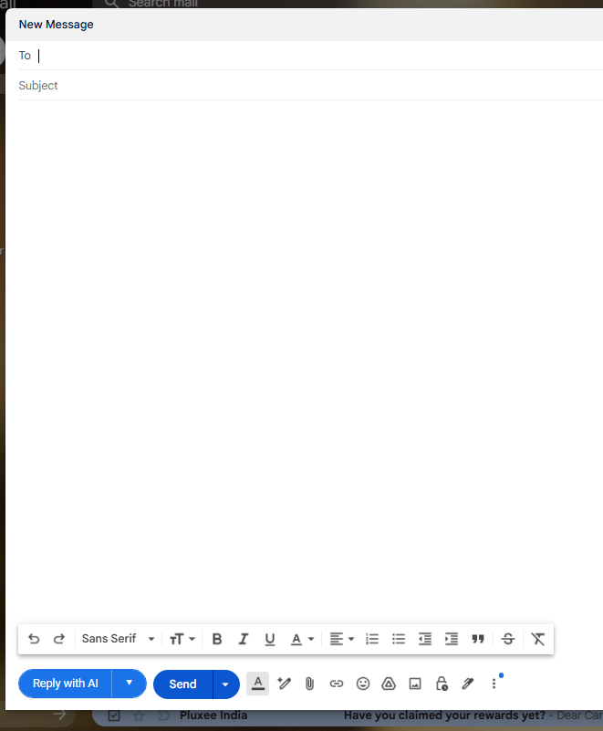
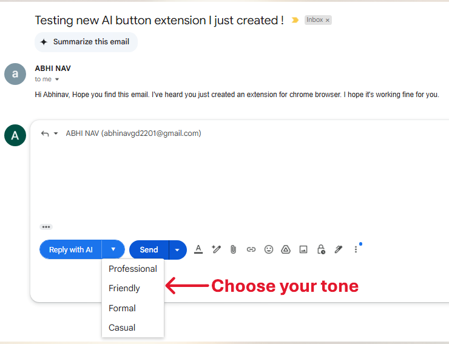
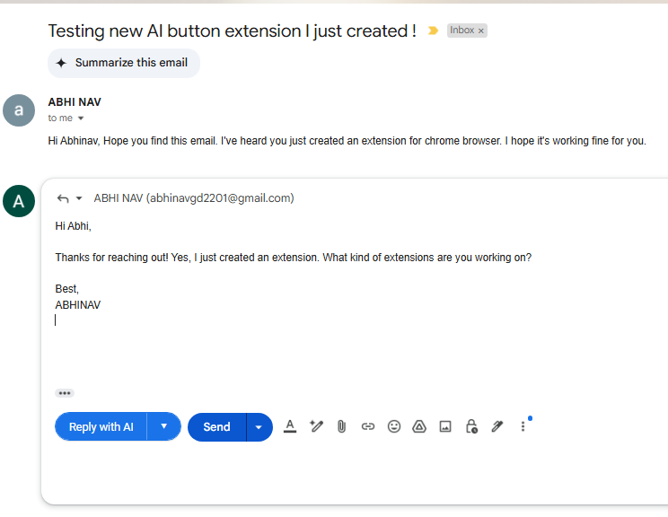

# 📧 Email Reply Assistant 🤖

An AI-powered assistant that helps generate context-aware email replies with customizable tone options. Built with a **React + Vite** frontend, **Spring Boot** backend, and a **browser extension** for seamless usage across Gmail.com.

---

## 🚀 Features

- ✍️ AI-generated replies from given email content
- 🎨 Choose from different tones (Professional, Friendly, Casual)
- ⚡ Fast and responsive frontend with Vite
- 🧠 Backend powered by Java + Spring Boot
- 🌐 Browser extension for Gmail-like integration
- 📋 One-click copy to clipboard

---

## 🗂️ Project Structure

```
email-assistant                                  → Spring Boot backend
email-assistant-ext                              → Chrome Extension
images                                           → UI screenshots & assets
email-assistant-react/public/src                 → React + Vite frontend
```

---

## 📦 Tech Stack

| Frontend        | Backend          | Extension     | Other        |
|-----------------|------------------|---------------|--------------|
| React + Vite    | Spring Boot (Java)| Manifest V3   | MUI (v5)     |
| Axios           | REST API         | JavaScript    | Vite         |

---

## 📂 Directory Overview

### 🔧 Backend - `email-assistant`
Java Spring Boot project with:
- `EmailGeneratorController` – API endpoint
- `EmailGeneratorService` – Business logic
- `EmailRequest` – Request DTO

Run it:
```bash
./mvnw spring-boot:run
```

API available at:
```
POST http://localhost:8080/api/email/generate
```

---

### ⚛️ Frontend - `src/` (React + Vite)
Modern UI built with Material UI (MUI) and React.

Start development server:
```bash
npm install
npm run dev
```

---

### 🧩 Browser Extension - `email-assistant-ext/`
Chrome extension to autofill email replies directly from the inbox.

Steps:
1. Go to `chrome://extensions`
2. Enable "Developer Mode"
3. Click **Load unpacked**
4. Select `email-assistant-ext` folder

---

## 📸 Screenshots

| Compose Area | Tone Selection | Final Reply Output |
|--------------|----------------|---------------------|
|  |  |  |

---

## 🛠️ Todo
- [ ] Add more tone options (e.g., Apologetic, Assertive)
- [ ] Add language support
- [ ] Deploy backend API to cloud
- [ ] Package extension for Firefox

---

## 🤝 Contributing

Pull requests are welcome. For major changes, please open an issue first to discuss what you'd like to change.

---

## 📄 License

This project is licensed under the MIT License - see the [LICENSE](LICENSE) file for details.
